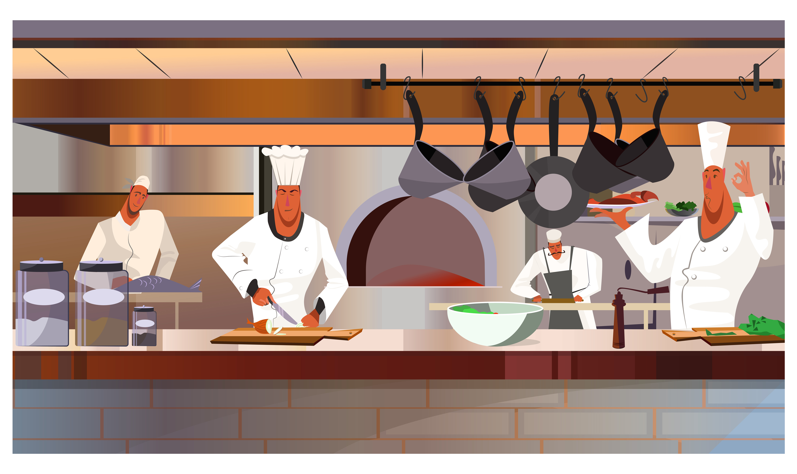
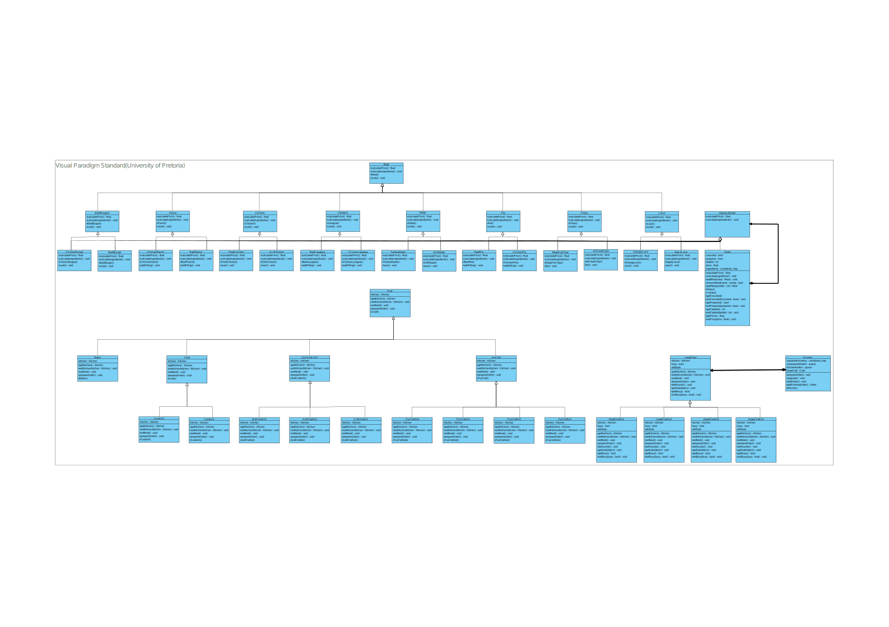

# 🌟🍽️ **Kitchen System Documentation** 🍽️🌟



## Project Details

- **Student Number:** 21573558
- **My Responsibilities In The Project:** 🚀
  1. **Designing the Kitchen System:** Led the design phase, defining system architecture, and user interface. 🔨
  2. **Implementing the Kitchen System:** Developed the core functionalities and features of the kitchen system. 💻
  3. **DevOps:** Managed the deployment, continuous integration, and infrastructure setup for the project. ⚙️

## System Overview

- **System Name:** Kitchen 🍳
- **Purpose:** 🍽️

   The kitchen is the hub of activity where the entire order fulfillment process takes place. It plays a crucial role in ensuring smooth operations in a restaurant. Here's a breakdown of the kitchen's purpose and workflow:

   1. An order is initiated by a waiter and sent to the kitchen.
   2. Orders are handled as they come in and assigned to different chefs based on the type of meal.
   3. Various chefs work collaboratively on an order, making different components of the order.
   4. The order may move between different chefs for various preparations before reaching the head chef.
   5. The head chef ensures the final assembly and quality check of the order.
   6. Once the order is complete, the kitchen notifies the waiter for order pickup. 🎉

## System Components

List the key components and modules of the Kitchen system: 🧰

1. Order
2. MenuItem
3. Chef
4. Kitchen

## 🍽️ Design Patterns for the Kitchen 🎨

1. **Prototype Pattern** 📜
   - *Use:* The Prototype Pattern allows for easy creation of various meal quantities when customers order. This ensures that the kitchen can efficiently handle different portion sizes of the same meal, such as burgers 🍔.

2. **Composite Pattern** 📊
   - *Use:* The Composite Pattern is employed to calculate the total price of an order and the necessary ingredients. In this pattern, the "Order" class acts as the composite, providing methods like "calculatePrice" and "calculateIngredients" to facilitate these calculations. This approach simplifies the management of complex meal orders 📋.

3. **Observer Pattern** 🔍
   - *Use:* The Observer Pattern is essential for efficient order management. When an order is complete, management is notified, and it is added to the appropriate queue, such as the "finishedOrders" or "canceled orders" queue. This ensures that orders are promptly processed and delivered to customers, enhancing the overall dining experience 🚀.

4. **Chain of Responsibility Pattern** 🔄
   - *Use:* The Chain of Responsibility Pattern streamlines the meal preparation process. Each chef is responsible for a specific part of an order. When an order is received, it starts with the Head Chef, who handles administrative duties and then delegates tasks to the appropriate chef. This process continues until the order is ready for serving. For instance, if an order includes a combo meal with a burger, chips, and a drink, the Head Chef manages administration, burger preparation, and drink preparation before passing it to the fry chef for the chips. Finally, it returns to the Head Chef for the final serving, ensuring a smooth and organized kitchen workflow 🍟.

## System Interactions in the Restaurant 🏢

1. **Accounting System:**
   The kitchen interacts with the accounting system to maintain ingredient inventory. When ingredient shortages are detected, the kitchen notifies the accounting system to order more supplies. Additionally, any upgrades or modifications to the kitchen's level are communicated to the accounting system to ensure accurate financial records. 💰

2. **Ordering System:**
   The ordering system facilitates the flow of orders within the restaurant. Customers place their orders with the waiter, who communicates these orders to the kitchen staff. In return, the kitchen notifies the waiter when an order is completed and ready for serving. This interaction ensures that orders are efficiently prepared and delivered to the customers in a timely manner. 📝

> **Note:** The use of pseudocode here is for representation purposes only, please follow coding standards diligently. 💡

## Order Creation Process 🍽️

1. The waiter creates the menu:

```cpp
waiter->createMenu();
```

2. Then, the waiter calls the `requestOrder` function in the menu, passing the customer:

```cpp
waiter->requestOrder(customer);
```

### Request Order Function 📝

```cpp
unordered_map requestOrder(Customer customer){
   return customer->getOrder(this);
}
```

### Get Order Function 📋

```cpp
unordered_map getOrder(Menu menu){
   unordered_map<string, int> output;
   int numMeals = getRandomNum(1, 5); // Generate a random number between 1 and 5 to determine the number of meals the customer is ordering.
   int quantity = 0;

   for(int i = 0; i < numMeals; i++){
      string mealName = menu->meals[getRandomNum(1, menu->numMeals)].second; // Get a random meal from the menu.
      quantity = getRandom(1, 5); // Get a random quantity between 1 and 5.
      output[mealName] = quantity; // Add the meal to the output.
   }

   return output;
}
```

## Building the Order Items🍳

You now have all the information needed to build the order items vector:

```cpp
vector<MenuItem> buildOrder(unordered_map<string, int> order){
   vector<Meal*> meals;
   for(auto meal : order){
      Meal meal = new Meal(meal.first, kitchen->getIngredients(meal.first));
      meals.push_back(meal);
      for(int i = 0; i < meal.second-1; i++){
         meals.push_back(meal->clone());

      }
   }
   return meals;
}
```

## Diagrams 📊

### UML Class Diagram


