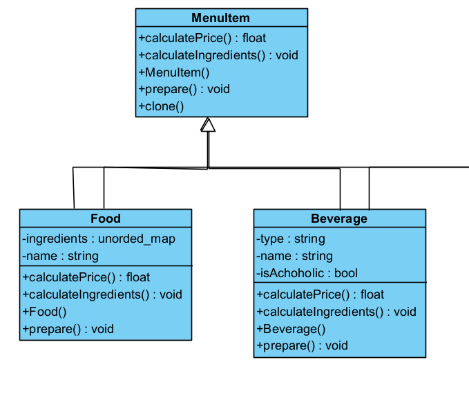
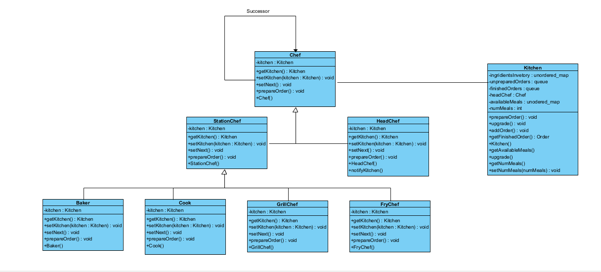
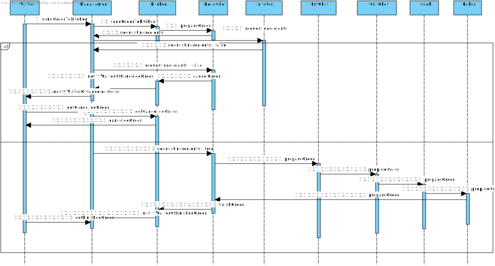
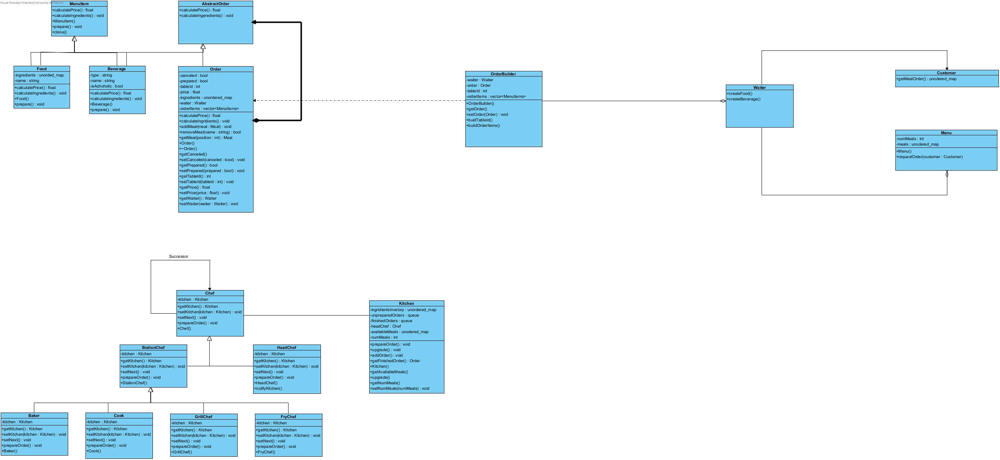

# 🌟🍽️ **Kitchen System Documentation** 🍽️🌟

## Project Details

- **Student Number:** 21573558
- **My Responsibilities in the Project:** 🚀
  1. **Designing the Kitchen System:** I led the design phase, defined the system architecture, and designed the user interface. 🔨
  2. **Implementing the Kitchen System:** I developed the core functionalities and features of the kitchen system. 💻
  3. **DevOps:** I managed the deployment, continuous integration, and infrastructure setup for the project. ⚙️

## Research Summary

In our quest to find a system in the restaurant industry to represent the kitchen in a video game we are creating, we came across the Brigade de Cuisine. The **Brigade de Cuisine**, also known as the **kitchen hierarchy**, is a hierarchical system found in restaurants and hotels employing extensive staff¹. This system was developed by **Georges Auguste Escoffier**². The Brigade de Cuisine ensures that kitchen operations run smoothly¹. The size and structure of the Brigade de Cuisine vary depending on the size and style of the restaurant¹.

Here are the key positions in the Brigade de Cuisine:

1. **Executive Chef**: Sits at the top of the kitchen hierarchy. Their role is primarily managerial. Executive chefs tend to manage kitchens at multiple outlets and are not usually directly responsible for cooking¹.

2. **Chef de Cuisine (Head Chef)**: Focuses on managerial duties relating to the whole kitchen. For example, they supervise and manage staff, control costs and make purchases, and liaise with the restaurant manager and suppliers to create new menus¹.

3. **Sous Chef (Deputy Chef)**: Shares many of the same responsibilities as the head chef, but they are much more involved in the day-to-day operations in the kitchen. The sous chef also fills in for the head chef when they are not present¹.

4. **Chef de Partie (Station Chef)**: This role is a vital part of the brigade system, but it’s split into many different roles. There is more than one chef de partie, and each one is responsible for a different section of the kitchen¹.

5. Specific chef de partie roles include:
   - **Sauté Chef/Saucier (Sauce Chef)**: Responsible for sautéing foods and creating sauces and gravies that accompany other dishes¹.
   - **Boucher (Butcher Chef)**: Prepares meat and poultry before they are delivered to their respective stations¹.
   - **Poissonnier (Fish Chef)**: Prepares fish and seafood¹.
   - **Rotisseur (Roast Chef)**: Responsible for roast meats and appropriate sauces¹.
   - **Friturier (Fry Chef)**: Prepares, and specializes in, fried food items¹.
   - **Grillardin (Grill Chef)**: Prepares grilled foods¹.

Each position holds an important role in the overall function of the kitchen¹. Despite this, it’s still important that you’re aware of the kitchen hierarchy and know how your position operates within this¹.

Sources:
(1) [Kitchen Hierarchy Explained | The Brigade de Cuisine - High Speed Training](https://www.highspeedtraining.co.uk/hub/kitchen-hierarchy-brigade-de-cuisine/).
(2) [Brigade de cuisine - Wikipedia](https://en.wikipedia.org/wiki/Brigade_de_cuisine).
(3) [Brigade de cuisine - Wikiwand](https://www.wikiwand.com/en/Brigade_de_cuisine).
(4) [Culinary Arts/The Kitchen Brigade - Wikibooks](https://en.wikibooks.org/wiki/Culinary_Arts/The_Kitchen_Brigade).
(5) [Kitchen Brigade: Ultimate List of Kitchen Staff and Descriptions](https://www.lightspeedhq.com/blog/kitchen-brigade/).

## Research Usage

With the Brigade de Cuisine in mind, we decided to create a system that would represent the kitchen in our game. The system would be responsible for preparing orders in our video game. Instead of creating strict adherences to the Brigade de Cuisine, we combined the roles of the head chef, executive chef, and sous chef into one role, known as the Head Chef. The other chefs, station chefs, remained as they are, with a few additions. For example, we added the baker and cook as station chefs, along with the grill and fry chef.

## System Overview

- **System Name:** Kitchen 🍳
- **Purpose:** 🍽️

   The kitchen is the hub of activity where the entire order fulfillment process takes place. It plays a crucial role in ensuring smooth operations in a restaurant. Here's a breakdown of the kitchen's purpose and workflow:

   1. An order is initiated by a waiter and sent to the kitchen.
   2. Orders are handled as they come in and assigned to different chefs based on the type of meal.
   3. Various chefs work collaboratively on an order, making different components of the order.
   4. The order may move between different chefs for various preparations before reaching the head chef.
   5. The head chef ensures the final assembly and quality check of the order.
   6. Once the order is complete, the kitchen notifies the waiter for order pickup. 🎉

## System Components

List the key components and modules of the Kitchen system: 🧰

1. Order
2. MenuItem
3. Chef
4. Kitchen

## 🍽️ Design Patterns for the Kitchen 🎨

1. **Prototype Pattern** 📜
   - *Use:* The Prototype Pattern allows for easy creation of various meal quantities when customers order. This ensures that the kitchen can efficiently handle different portion sizes of the same meal, such as burgers 🍔.
   - 

2. **Composite Pattern** 📊
   - *Use:* The Composite Pattern is employed to calculate the total price of an order and the necessary ingredients. In this pattern, the "Order" class acts as the composite, providing methods like "calculatePrice" and "calculateIngredients" to facilitate these calculations. This approach simplifies the management of complex meal orders 📋.
   - 

3. **Chain of Responsibility Pattern** 🔄
   - *Use:* The Chain of Responsibility Pattern streamlines the meal preparation process. Each chef is responsible for a specific part of an order. When an order is received, it starts with the Head Chef, who handles administrative duties and then delegates tasks to the appropriate chef. This process continues until the order is ready for serving. For instance, if an order includes a combo meal with a burger, chips, and a drink, the Head Chef manages administration, burger preparation, and drink preparation before passing it to the fry chef for the chips. Finally, it returns to the Head Chef for the final serving, ensuring a smooth and organized kitchen workflow 🍟.
   - 

## System Interactions in the Restaurant 🏢

1. **Accounting System:**
   The kitchen interacts with the accounting system to maintain ingredient inventory. When an order comes in, ingredients are requested. If shortages are detected, the system will buy more; if no shortages are found, the system will subtract from the inventory. Additionally, any upgrades or modifications to the kitchen's level are communicated to the accounting system to ensure accurate financial records. 💰

2. **Management:**
   The kitchen interacts with management to ensure that orders are processed efficiently. Management should not implement anything but act as a facade for interaction between different sub-systems. 🚀

3. **Ordering System:**
   The ordering system facilitates the flow of orders within the restaurant. Customers place their orders with the waiter, who communicates these orders to the kitchen staff. In return, the kitchen notifies the waiter when an order is completed and ready for serving. This interaction ensures that orders are efficiently prepared and delivered to the customers in a timely manner. 📝
   - Detailed sequence diagram: 

## UML Class Diagram 📊

