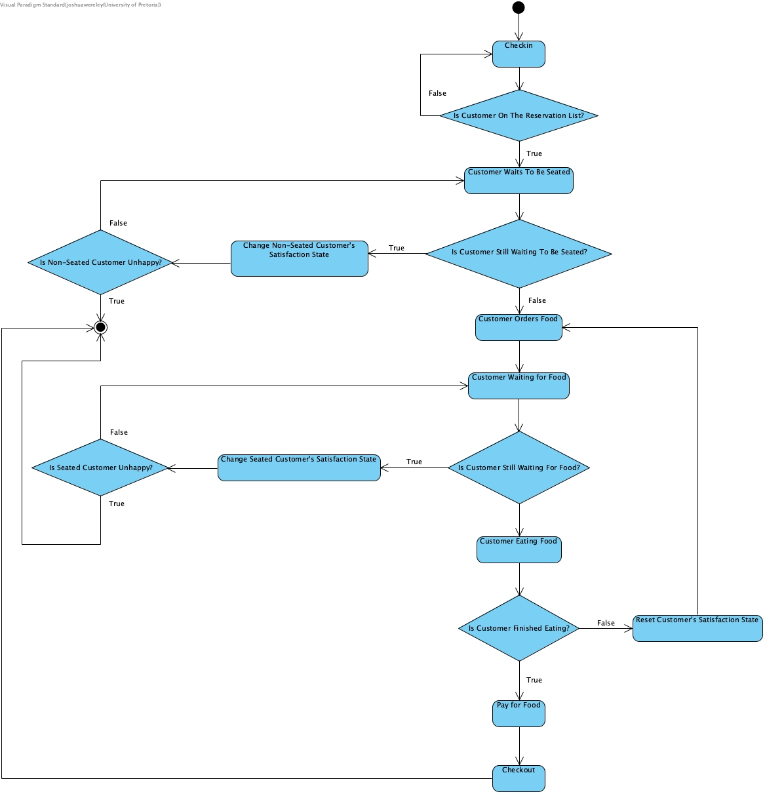
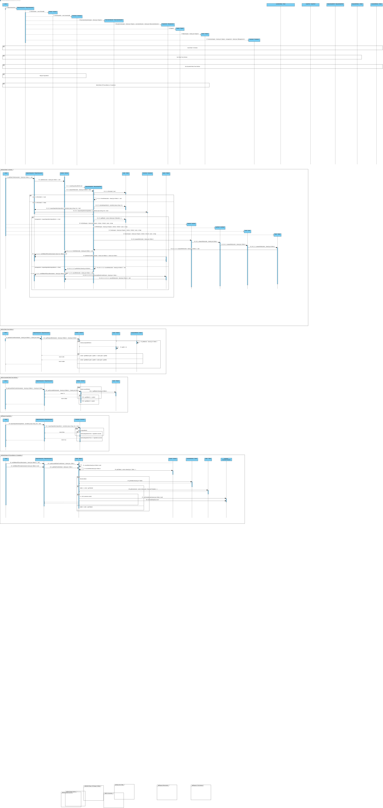

# Project README

## Author: Joshua Tristan Wereley
## Student Number: u21506915

## Project Responsibilities:
1. **Implementing Management System:** Designed and extended the final UML class diagram and coded the functionality to interact with the different game components.
2. **Design the UML Class Diagram**
3. **Design the UML Sequence Diagram**
4. **Design the UML Communication Diagram** 

## System Name: Management

### Purpose:
The management system's purpose is to employ a strategic approach to oversee interactions among the different game components; ensuring that each component's requests are harmoniously coordinated.

### Components:
The management system is divided into two subsystems, namely:
* **Game Engine System:** This subsystem serves as the focal point for managing interactions among a group of objects; encapsulating the way they communicate with each other. 
* **Player Interaction System:** This subsystem is responsible for encapsulating requests into objects, providing a means for parameterized clients to generate requests, manage request queues, and facilitate the reversal of changes.

### Design Patterns:
The management system will use two design patterns; one for each subsystem:
* Mediator Pattern: 
    * **Objective:** To define an object that encapsulates interactions among a group of objects, fostering loose coupling by avoiding direct references between objects and enabling independent variations in their interactions.
    * **Rationale for Use:** The Mediator Pattern facilitates interaction between game components by notifying each component of changes and how these changes may impact other components.
    * **Illustrative Use Case:** For instance, the Accounting System could communicate with the Cooking System to check if there are sufficient ingredients for a particular dish.
* Facade Pattern:
    * **Objective:** To provide a unified interface to a set of interfaces in a subsystem. It defines a higher-level interface that makes the subsystem easier to use.
    * **Rationale for Use:** The Facade Pattern simplifies the complex interactions and operations within the Player Interaction System, providing a single, simplified interface for clients to interact with the subsystem.
    * **Illustrative Use Case:** When a player interacts with the game, they use a single, easy-to-use interface provided by the Facade to make requests, manage queues, and reverse changes without needing to understand the internal complexities.

### Systems Interaction:
The management system will interact with the following systems:
* **Accounting System:**
* **Reservation System:**
* **Customer Care System:**
* **Ordering System:**
* **Cooking System:**

## Diagrams

### UML Class Diagrams

### UML State Diagram

### UML Sequence Diagram

### UML Communication Diagram
